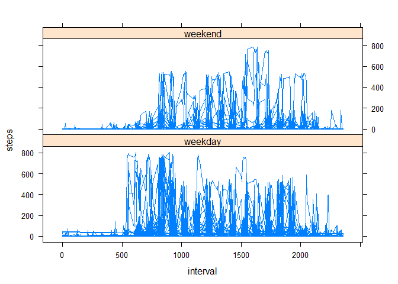

# Reproducible Research: Peer Assessment 1

## Loading and preprocessing the data


```r
act <- read.csv("activity.csv")
act$interval <- as.factor(act$interval) 
    #transforming interval's class from integer to factor
dlist <- levels(act$date)
ilist <- levels(act$interval)
```


## What is mean total number of steps taken per day?

- Calculate the mean and total number of steps taken per day

```r
sum_day <- sapply(split(act$steps, act$date), sum)
mean_day <- sapply(split(na.omit(act$steps), act$date), mean)
```

```
## Warning in split.default(na.omit(act$steps), act$date):
## 数据长度不是分割变数的倍数
```

- Make a histogram of the total number of steps taken each day.

```r
hist(sum_day)
```

 

- Calculate and report the mean and median of the total number of steps taken per day

```r
mu_day <- mean(na.omit(sum_day)); mu_day
```

```
## [1] 10766.19
```

```r
md_day <- median(na.omit(sum_day)); md_day
```

```
## [1] 10765
```


## What is the average daily activity pattern?

- Make a time series plot of the 5-minute interval (x-axis) and the average number of steps taken, averaged across all days (y-axis)

```r
mean_i <- as.data.frame(sapply(split(na.omit(act$steps), act$interval), mean))
```

```
## Warning in split.default(na.omit(act$steps), act$interval):
## 数据长度不是分割变数的倍数
```

```r
interval_mean <- cbind(mean_i, ilist)
names(interval_mean)<-c("mean","interval")
```


```r
library(lattice)
xyplot(mean~interval, data=interval_mean, type="l")
```

 

- Which 5-minute interval, on average across all the days in the dataset, contains the maximum number of steps?

```r
interval_mean[order(-interval_mean$mean),][1,]
```

```
##         mean interval
## 835 206.1698      835
```

## Imputing missing values

- Calculate and report the total number of missing values in the dataset (i.e. the total number of rows with NAs)

```r
na <- na.omit(act)
dim(act)[1]-dim(na)[1]
```

```
## [1] 2304
```

- Devise a strategy for filling in all of the missing values in the dataset.
**Here use the mean for that 5-minute interval.**  
Create a new dataset that is equal to the original dataset but with the missing data filled in.

```r
act1 <- read.csv("activity.csv")
for (i in 1: nrow(act1))
    if (is.na(act1$steps[i]))
        for (j in 1:288)
            if (row.names(mean_i)[j]== act1$interval[i]) {
                act1$steps[i] <- mean_i[j,];
                break
            }
```

- Make a histogram of the total number of steps taken each day and Calculate and report the mean and median total number of steps taken per day. 

```r
sum_day1 <- sapply(split(act1$steps, act1$date), sum)
hist(sum_day1)
```

 

```r
mu_day1 <- mean(sum_day1); mu_day1
```

```
## [1] 10766.19
```

```r
md_day1 <- median(sum_day1); md_day1
```

```
## [1] 10766.19
```

- With the missing values insteaded by the mean for that 5-minute interval, the mean total number of steps taken per day is the same as the median.  

And also, the mean now 1.0766189\times 10^{4} is same as that of the first part of the assignment 1.0766189\times 10^{4}.  
But the median now 1.0766189\times 10^{4} is different from that of the first part of the assignment 10765

## Are there differences in activity patterns between weekdays and weekends?

Use the dataset with the filled-in missing values for this part.  
Use lubridate package for weekday processing.

- Create a new factor variable "wday" in the dataset with two levels – “weekday” and “weekend” indicating whether a given date is a weekday or weekend day.

```r
library(lubridate)
act1 <- cbind(act1, wday=c("weekday","weekend"))
for (i in 1:nrow(act1)){
	if (wday(act1$date[i])>1 & wday(act1$date[i])<7)
		{act1$wday[i]="weekday"}
	else {act1$wday[i]="weekend"}
}
```

- Make a panel plot containing a time series plot (i.e. type = "l") of the 5-minute interval (x-axis) and the average number of steps taken, averaged across all weekday days or weekend days (y-axis). 

```r
xyplot(steps ~interval | wday, , data=act1, layout =c(1,2), type="l") 
```

 
